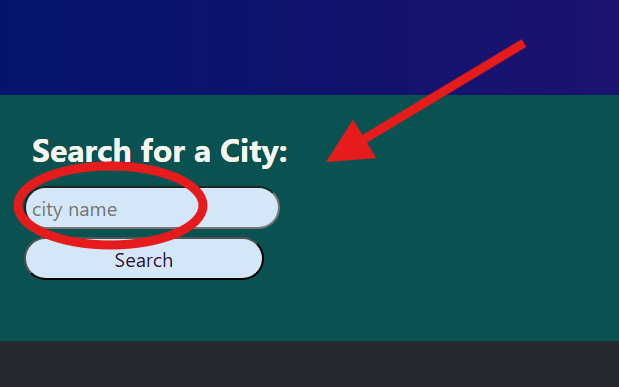
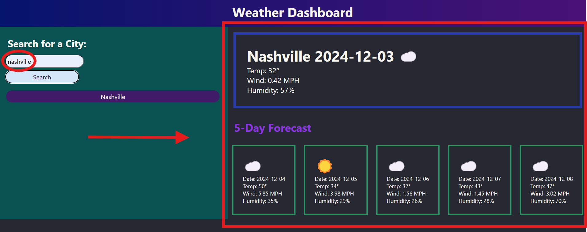
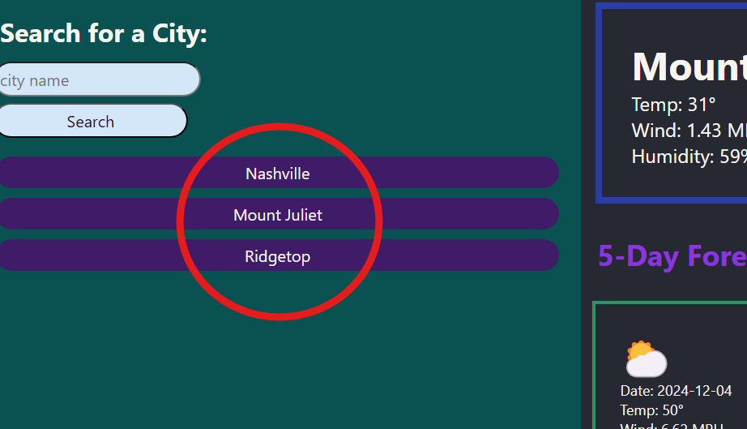

# Weather Dashboard

  
## Description

This website allows you to search the current weather of any city, using only the name of the city itself. You will also be presented with a five day forecast of what the weather will be like for the next five days in that city. This can be a useful tool to quickly check the weather in different cities if you are travelling, or trying to decide on a weekend destination and want to know what the weather will be like when you arrive.

## Contents

- [Installation](#installation)
- [Usage](#usage)
- [Credits](#contributing)
- [License](#license)

## Installation

In order to see the weather for the city you want, you must first type in the name of the city into the search bar, and then click search.

Then you will be presented witht he current weather in the city, and the weather for the next five days.

## Usage

Once you submit a search for a city, that city wil be saved to the searches on the left side of the screen so that you can easily navigate back to cities that you previoussly searched for.

## Contributing

This project was coded independantly by github user mcellis1 with some help from the extensive MDN web documentation.

## License

This project uses the MIT license. Refer to the [license document](./LICENSE) for more information.

## Questions

Questions about the project should be directed through the following contacts below.
Link to github profile: [mcellis1](https://github.com/mcellis1)
Email: [matthewcellis98@gmail.com](mailto:matthewcellis98@gmail.com)
